  
  
  
  
  
  

  
  
  

## `//` about

I'm **g8tsz**, a developer specializing in **automation** and **anti-cheat / game integrity**. I build low-level tooling that sits between games and their runtime — overlays, memory instrumentation, anti-tamper hooks — and the automation scaffolding around it: CI pipelines, monitoring, and fraud-detection systems for regulated casino operators.

I'm most comfortable reading binaries, writing C/C++ against Windows internals, and wiring the results up to TypeScript or Python services. I care about software that has to be *correct under adversarial conditions* — the kind of code where the user is actively trying to break it.

> Public repos here are reference / research. Anything client-facing stays under NDA.

## `//` stack

A curated view — not everything I've touched, just what I'd defend in a code review.

| Depth | Tools |
|---|---|
| **Expert** | C, C++, reverse engineering, Windows internals, anti-cheat architecture |
| **Strong** | Python, TypeScript, Java, automation & CI/CD, overlay rendering, fraud detection |
| **Working knowledge** | Rust, assembly, Node.js, PostgreSQL, Docker, GitHub Actions |

  

  
  
  
  
  

## `//` featured work

<table>
<tr>
<td width="50%" valign="top">

**deadlock-anti-cheat** — User-land anti-cheat research for Valve's *Deadlock*. Hooking, integrity checks, and tamper detection in C.

</td>
<td width="50%" valign="top">

**deadlock-overlay** — In-game information overlay rendered from the outside. Written in HTML/JS with a native host.

</td>
</tr>
<tr>
<td width="50%" valign="top">

**casino-fraud-tracker** — TypeScript service that monitors player sessions and flags statistically anomalous behaviour for review.

</td>
<td width="50%" valign="top">

**casino-kyc-integration** — KYC / AML verification pipeline for regulated casino operators. TypeScript, third-party identity APIs, queueing.

</td>
</tr>
<tr>
<td colspan="2" valign="top">

**marker-tito-replacement** — JavaScript tooling to replace legacy TITO (ticket-in/ticket-out) marker workflows on the casino floor.

</td>
</tr>
</table>

## `//` currently

- Hardening the **casino-fraud-tracker** detection rules and adding replayable session logs
- Experimenting with **eBPF-style** user-land tracing on Windows for cheat detection
- Writing up a short post on why **client-side anti-cheat is a trust boundary, not a solution**

## `//` activity

<table>
<tr>
<td>

</td>
<td>

</td>
</tr>
</table>

<picture>
  <source media="(prefers-color-scheme: dark)" srcset="https://raw.githubusercontent.com/g8tsz/g8tsz/output/github-snake-dark.svg" />
  <source media="(prefers-color-scheme: light)" srcset="https://raw.githubusercontent.com/g8tsz/g8tsz/output/github-snake.svg" />
  
</picture>

## `//` contact

Open to **consulting, contract, and full-time work** in game security, anti-cheat engineering, casino fraud / compliance tooling, and any form of **automation or spoofing**.

**Have a project in mind?** Start here — it takes 2 minutes:

  

  

